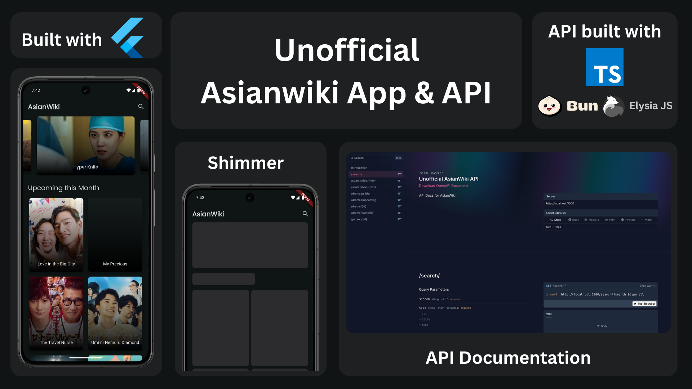

    <h1>AsianWiki API</h1>
    

    Unofficial an API version of <a href="https://asianwiki.com/Main_Page">AsianWiki.com.</a>
     
    Part of project <a href="https://github.com/Mufiidz/AsianWikiApp">AsianWiki App.</a>
    

---

  

## API Docs Coming Soon

Documentation in progress. Awaiting until all response structures are finalized for a complete and accurate reference.

## Tech Stack & Library

- [cheerio](https://cheerio.js.org/) for web scraping.
- [luxon](https://moment.github.io/luxon/#/) for JavaScript dates and times.
- [translate](https://www.npmjs.com/package/translate) for convert text to different languages.
- and any more [libraries](https://elysiajs.com/plugins/overview.html) related in [package.json](package.json).

## Data Source

AsianWiki API is a RESTful API built using data scraped from [AsianWiki.com](https://asianwiki.com/Main_Page).
This unofficial API provides structured access to Asian drama and movie information — including titles, casts, genres, and synopses — making it easy to integrate AsianWiki data into your applications.
